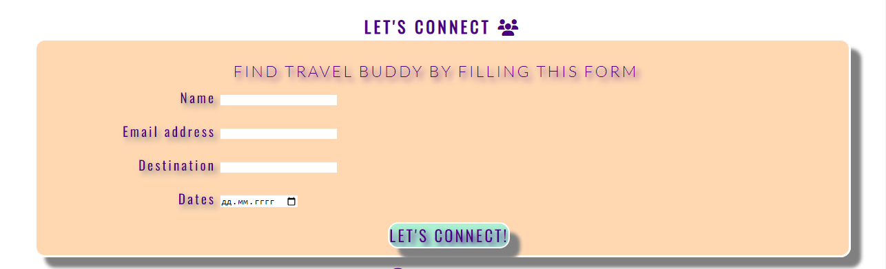

# FEMALE SOLO TRAVEL

---

Female Solo Travel website is a landing page for women looking for solo-travel tips, destinations or a travel-buddy. Female Solo Travel is a community that empowers women through travel.
Users of this website will be able to find all the information they need about solo travels. This site is targeted towards women who travel alone.

## FEATURES
* ### Navigation
  * featured at te top of the page, the navigation links are: "lifehacks", "trips" and "Let's connect" which link to the different sections of the same page.
  * the navigation is fully responsive and in color that contrasts with background.
  * the navigation links have icons which make it easier for user to choose the section they want to go to. 
  

---
* ### The Hero image
  * The Hero image includes a picture with a text overlay to motivate the User.
  * This section introduces the user to Female Solo Travel with an eye catching image and a motto. 
  

  ---
* ### Main theme
  * The main theme section consists of paragraphs which describe the concept of Female Solo Travel. 
  ---
* ### Lifehacks
  * this section provides important tips for women who travel alone.
  ---
* ### Community Trips
  * Community Trips section gives examples of trips organised and provided by community.
   * This section has images of provided trips and links that allow User to find out more information about chosen trip.
   

   ---
* ### Let's Connect
   * Let's Connect section has a form to collect details from women so they can choose travel partner from The Community.
   * the form collects User's name, email address, destination and dates of future trip.
   * Let's connect section gives Solo Female travellers safe way to find a travel partner.
   

   ---
* ### Contacts section
   * The Contacts section contains icons which are links to Social media of Female Solo Travel Community.
   * This section provides telephone number and email address to get in touch and a motivational quote for user. 
   

  ---

 * ### Testing
   * this webpage works in different browsers: Chrome, Safari, Opera
   * I made sure that the page is responsive and functions properly on all standart screen sizes by using devtools device toolbar
   * 

