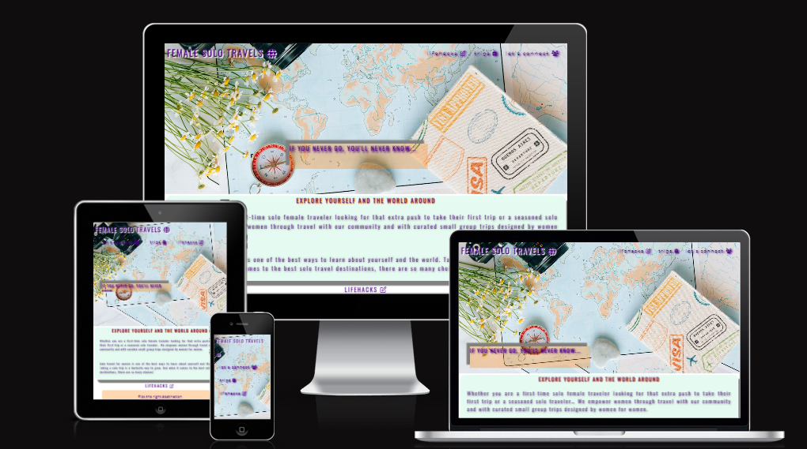
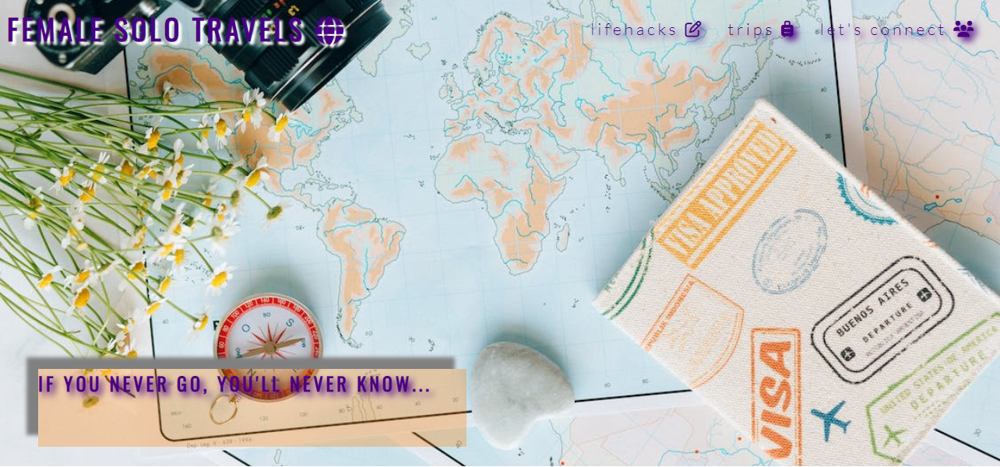
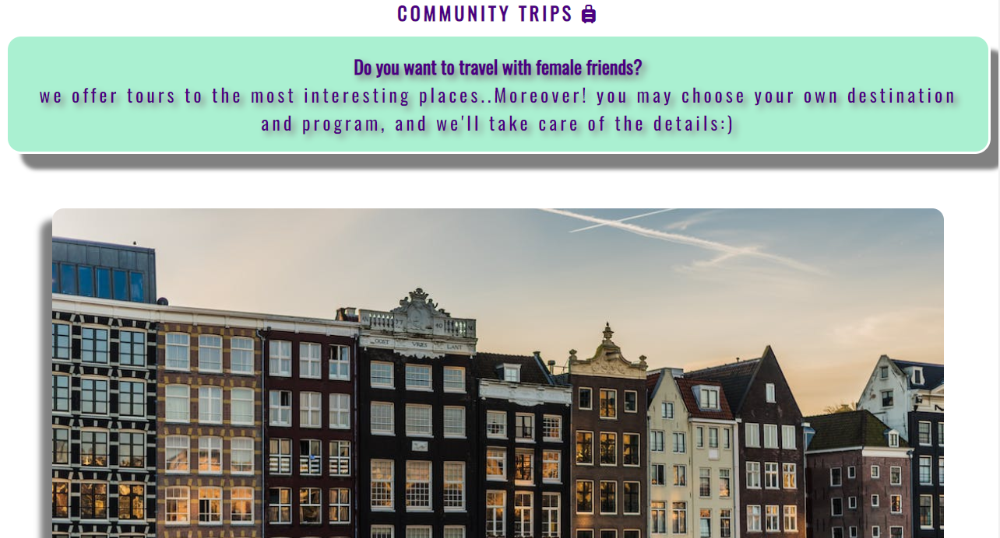

# FEMALE SOLO TRAVEL

The Live link to website can be found here - [FEMALE SOLO TRAVEL](https://annatolchynska.github.io/female-solo-trip/)

---

Women taking vacations alone have recently become synonymous with self-care, it is an opportunity for wellness, freedom and empowerment. Research shows that women enjoy adventure of solo-travel and like to immerse themselves in a foreign culture more so than men.
Female Solo Travel website is a landing page for women looking for solo-travel tips, destinations and exclusive tours or a travel-buddy. Female Solo Travel is a community that empowers women through travel.
Users of this website will be able to find all the information they need about solo travels. This site is targeted towards women who travel alone.

---

### Creative process

   * The idea of the website seems relevant strategy-wise. The information on site can be valuable for user as well as for business. 
   * The site is simple, consists of one page, text, images, navigation menu, form and links, has all the information that attracts the user and it has potential of developing bit by bit.
   * The next step of creating site was building a mockup by using [Balsamiq wireframes]("https://balsamiq.com/wireframes/")
   
   
   ---

### Design
   * While building this website I was using Lato and Oswald fonts, there is a theme of three main colors on the page, which are appealing to user's eye, have a sufficient contrast ratio. 
 * The webpage has eye-pleasing images, that motivate user to make this decision: to go and explore the World.
* The elements has 3d styling effect, which represents traveler - constantly "floating" (moving).

    ---

### Future Features
 * Community trips section
    * This section will have links to pages that give actual information (program, price, info of groups and places to stay) of the trip.
    * It'll have nore information about exclusive tours as well and examples of some.
* Feedback
    * The page will have a feedback section. This section will have an interal link in navigation menu. User will be able to share and read their impressions of solo trips as well as trips that were booked in our community and/or with people from community. There will be an opportunity to share personal opinion for further improvement of Female Solo Travel community.

---

## FEATURES
* ### Navigation
  * featured at the top of the page, the navigation links are: "lifehacks", "trips" and "Let's connect" which link to the different sections of the same page.
  * the navigation is fully responsive and in color that contrasts with background.
  * the navigation links have icons which make it easier for user to choose the section they want to go to. 
  

---
* ### The Hero image
  * The Hero image includes a picture with a text overlay to motivate the User.
  * This section introduces the user to Female Solo Travel with an eye catching image and a motto. 
  

  ---
* ### Main theme
  * The main theme section consists of paragraphs which empower User to make that step and travel alone and join Female Solo Travel community. 
  ---
* ### Lifehacks
  * this section provides important tips for women who travel alone.
  
  ---
* ### Community Trips
  * Community Trips section gives examples of trips organised and provided by community.
   * This section has images of provided trips and links that allow User to find out more information about chosen trip or to get in touch and organize exclusive tours.
   
   ---
* ### Let's Connect
   * Let's Connect section has a form to collect details from women so they can choose travel partner from The Community.
   * The form collects User's name, email address, destination and dates of future trip.
   * Let's connect section gives Solo Female travellers safe and easy way to find a travel partner.
   

   ---
* ### Contacts section
   * The Contacts section contains icons which are links to Social media of Female Solo Travel Community.
   * This section provides telephone number and email address to get in touch and a motivational quote for user. 
   

  ---

 * ### Testing
   * This webpage works in different browsers: Chrome, Safari, Opera.
   * I made sure that the page is responsive and functions properly on all standart screen sizes by using devtools device toolbar.
   * I made sure that navigation, links, lifehacks are all readable and easy to understand.
   * The form works: every field requires to be filled, email address requires only email address, dates field requires only dates, submit button works properly.
* ### Bugs and Unfixed Bugs
   * In "community-trips" section there are links on each image that are supposed to give detailed info about the trip. These links take user to [Wikitravel]("https://wikitravel.org/") pages because pages that they're referred to do not exist yet.
   * when testing I found that my links don't have discernible name, so it was fixed by adding "aria-label" to elements.
   * No other bugs are found.
   ---
 ### Validator testing 
* HTML 
   
   * When I was testing the site by HTML validator the further erors were found:
    
    
    They all were fixed.
    
* CSS
   * No errors were found passing through the official (Jigsaw) validator.
   
* Accessibility
   * I made sure that background and foreground colors have a sufficient contrast ratio and is easy to read for user, link text and alt text for images all have discernible name by running it through lighthouse in devtools.
   

   ---

   

--- 
### Deployment
* The site was deployed to GitHub pages by following steps:
   * Git Hub repository choose Settings tab and Pages
   * From drop down menu source section pick main Branch
   * once the Save button been clicked the page provided the link to the completed website.
The Live link can be found here - [FEMALE SOLO TRAVEL](https://annatolchynska.github.io/female-solo-trip/)

---

### Technology used
 * While creating the site I was using GitHub, GitPod, HTML, CSS, Microsoft Paint Editor, Balsamiq Wireframes.
* For testing the site: Lighthouse in devtools, HTML validator, the official (Jigsaw) validator
### Credits
* ### Content
  * The text for the lifehacks was taken from [22 must know travel hacks for the solo female traveler](https://sarahshireen.com/travel-hacks-solo-female-traveller/)
  * The text for the main-theme was taken from [solo female travelers](https://www.solofemaletravelers.club/solo-female-travel-blog/) and [The Blonde Abroad](https://www.theblondeabroad.com/start-here/)
  * The icons were taken from [ FontAwesome ](https://fontawesome.com/)
  * The code for navigation menu, social links in the footer-section was taken from Love Running project.
  * Some text for ReadmeFile was taken from Sample Coding Club project and Sample Love Running project.
* ### Media
  * All images were taken from [Pexels](https://www.pexels.com/)
    

  

